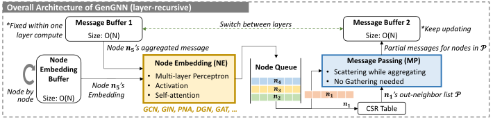

# GenGNN: A Generic FPGA Framework for Graph Neural Network Acceleration

Stefan Abi-Karam*, Yuqi He*, Rishov Sarkar*, Lakshmi Sathidevi, Zihang Qiao, Cong Hao  
*equal contribution

## Overview

This is **GenGNN**, a generic GNN acceleration framework using High-Level Synthesis (HLS) with two-fold goals. First, we aim to deliver ultra-fast GNN inference without any graph pre-processing for real-time requirements. Second, we aim to support a diverse set of GNN models with the extensibility to flexibly adapt to new models.

Currently, this repository contains prebuilt bitstreams for the Xilinx Alveo U50 FPGA along with supporting host code. Our HLS code will be open-source upon acceptance.
